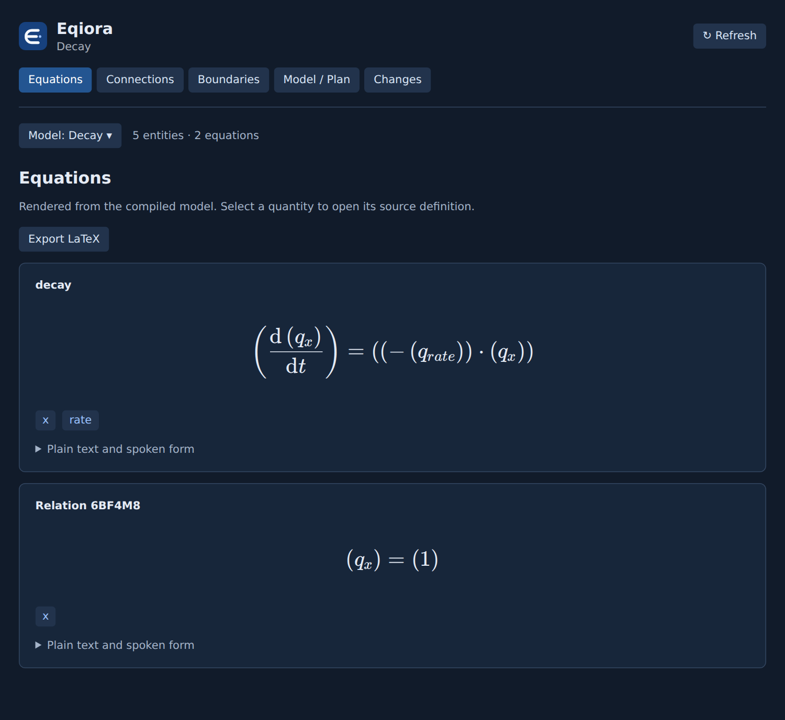

<p align="center"></p>
<h1 align="center">Eqiora for Visual Studio Code</h1>
<p align="center">Write the model. Read the equations. Explore the physics.</p>

The official Eqiora extension connects `.eqi` source to the mathematics it describes.
Eqiora owns parsing, units, physical meaning and numerical execution; this extension
connects its language server to VS Code and renders its inspection results.



## Features

- **Editing:** canonical highlighting, snippets, brackets, comments, indentation,
  diagnostics, formatting, documented completion and signature help, hover with
  reference/textbook links, definitions, references, symbols and folding.
- **Equation Preview:** live LaTeX display with accessible MathML/plain text,
  source navigation, cursor highlighting, model selection and LaTeX export.
- **Model Hierarchy:** nested declarations with navigation to source.
- **Ports and Connections:** compiled entities, connection roles and source definitions.
- **Boundary Condition Map:** topology of domains, supports and boundary ports.
- **Model / Plan:** physical model inventory alongside an explicitly opened numerical
  Plan artifact (`.eqplan`). A server with Plan inspection support validates canonical
  bytes and reports exact Model binding; the view does not execute the Plan.
- **Semantic Changes:** capture a baseline and compare the compiler's bounded
  structural fingerprint, alongside before/after equation text.

Rich views are optional. Syntax highlighting works without a server or workspace
trust. The language server reports type and unit errors; the extension does not
maintain another parser, unit system or scientific evaluator.

## Install

Install **Eqiora** (`eqiora.eqiora`) from the
[Visual Studio Marketplace](https://marketplace.visualstudio.com/items?itemName=eqiora.eqiora)
or [Open VSX](https://open-vsx.org/extension/eqiora/eqiora).
In Visual Studio Code, you can also run:

```sh
code --install-extension eqiora.eqiora
```

For an offline installation, download the `.vsix` matching your workspace host
from [GitHub Releases](https://github.com/eqiora/eqiora-vscode/releases), then choose
**Extensions → … → Install from VSIX**. All three distribution routes carry the
tested release packages with the matching language server. See
[publishing](docs/publishing.md) for release maintenance.
Native packages are available for Linux x64, Windows x64 and macOS Apple Silicon.

If you installed the initial `nkiyohara.eqiora` VSIX, uninstall it before installing
`eqiora.eqiora` to avoid running two language clients.

For source builds without a bundled server, install the server from the exact
Eqiora revision in [upstream.json](upstream.json), or use **Eqiora: Select Language
Server**. An older LSP server can provide basic editing; rich views require
`experimental.eqioraInspection = 1`.

Open an `.eqi` file, then choose **Eqiora: Open Equation Preview** or use the equation
button in the editor title. The Eqiora activity bar contains model, port and
boundary explorers. Try **Eqiora: Open Example Model** to see exponential decay.

[Learn the mathematics](https://eqiora.org/learn/) ·
[Language reference](https://eqiora.org/reference/language/) ·
[Settings and commands](docs/guide.md) · [Development](CONTRIBUTING.md)

## Environments and boundaries

The extension runs on the **workspace host**: local desktop, SSH, WSL, a development
container or Codespaces. Configure a server for that host's OS and architecture.
A browser connected to Codespaces uses its remote native extension host; standalone
vscode.dev virtual workspaces are not supported.

Compiled inspection uses unsaved source and the server's exact local-package graph.
Models that need unbound parameters, invalid edits and unsupported renderings show
explicit analysis notes. An invalid or stale response cannot masquerade as a current
successful preview. Boundaries are a topological view, not a CAD viewport.

Structural comparison uses the compiler's supported vocabulary and resource bounds;
it does not promise identical solver outputs. This extension does not run models,
infer solvers, display complex or modal Results, implement rename or rank completion
by inferred type/unit. Completion covers keywords/templates, current-scope names,
canonical imports, public and exposed members, and remaining named arguments.

## Ownership

- [Eqiora](https://github.com/eqiora/eqiora): language, compiler, mathematical
  rendering, language server and canonical syntax bundle.
- This repository: editor integration, settings, rich views, icons, packaging and
  independent extension releases.

The syntax bundle and brand mark are copied from an exact Eqiora commit by
`npm run sync:upstream`. Change their sources in Eqiora first.

Licensed under Apache-2.0. KaTeX is included under its MIT license.

Numerical Plan inspection requires a server advertising `eqioraPlanInspection: 1`;
the currently bundled server predates this capability and reports a clear unsupported
message. Set `eqiora.server.path` to a compatible development server until the next
server bundle is published. Accepted artifacts use the native canonical Plan codec
and installed provider versions; arbitrary or reformatted JSON is rejected.
